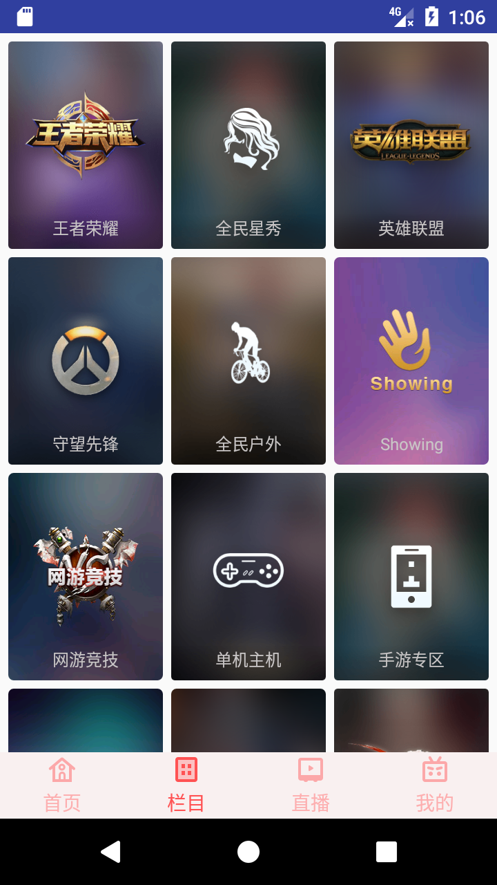

# QuanMinTV

*基于RxJava + Retrofit + MVP + vitamio 开发的仿全民TV，仅供学习使用，侵权立删。*

模仿全民直播APP做的一款练手项目，因为是毕设项目，所以将名字改为了翩翩直播，
主要用来练习MVP、Retrofit、RxAndroid的使用，该项目主要分为四个模块，首页，栏目，
直播和我的模块。

### 声明
本项目仅供学习测试使用，不用于任何商业用途，如有侵犯，请联系本人立即删除。

 

<a href="screenshot/app-debug.apk/">Download</a> 

### 预览
* 首页

* 栏目

* 直播

* 我的

* 播放

### 不足与展望
* 视频播放使用的vitamio，准备改为ijkplayer或其他播放器
* 视频播放时，兼容运行时权限调节音量、亮度
* 第三方登录暂时只能QQ登录
* 弹幕功能未实现
* 视频播放线路选择与清晰度选择